# Clairvoyance — Architecture

This document explains how every part of the system works, from authentication through data upload to chart rendering.

---

## 1. System Overview

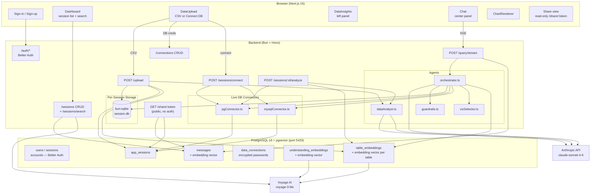

---

## 2. Authentication & Session Guard

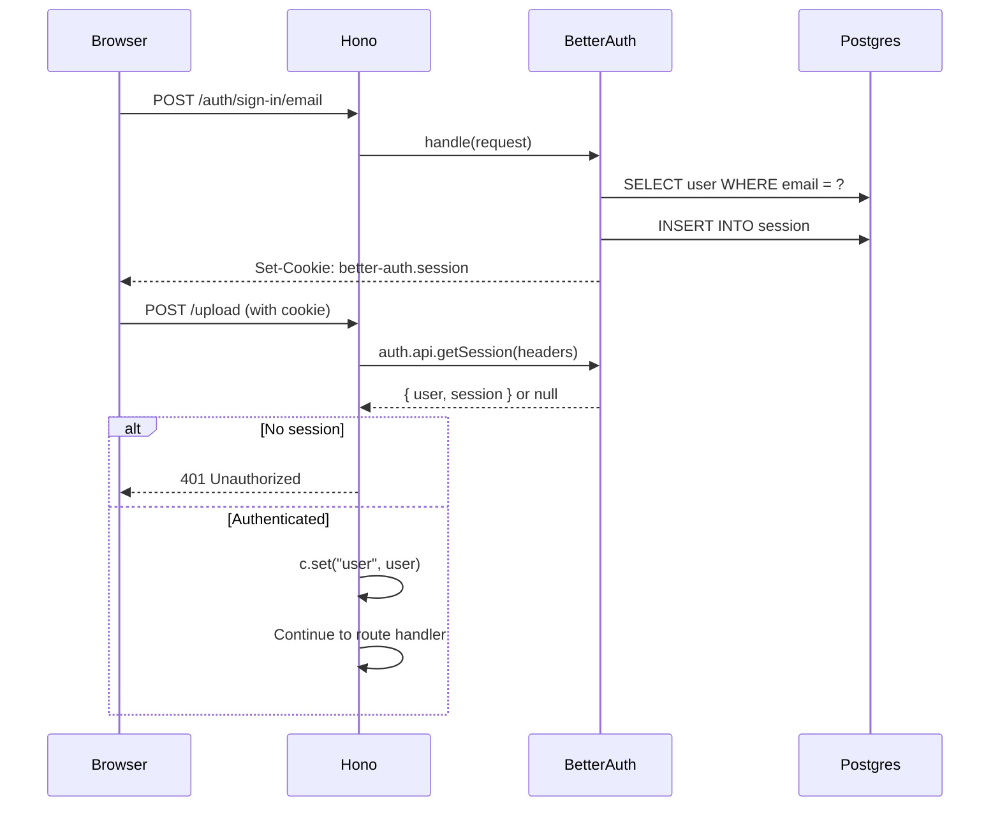

Routes exempted from auth: `/health`, `/auth/*`, `/share/:token`.

---

## 3. Upload & Data Understanding Flow

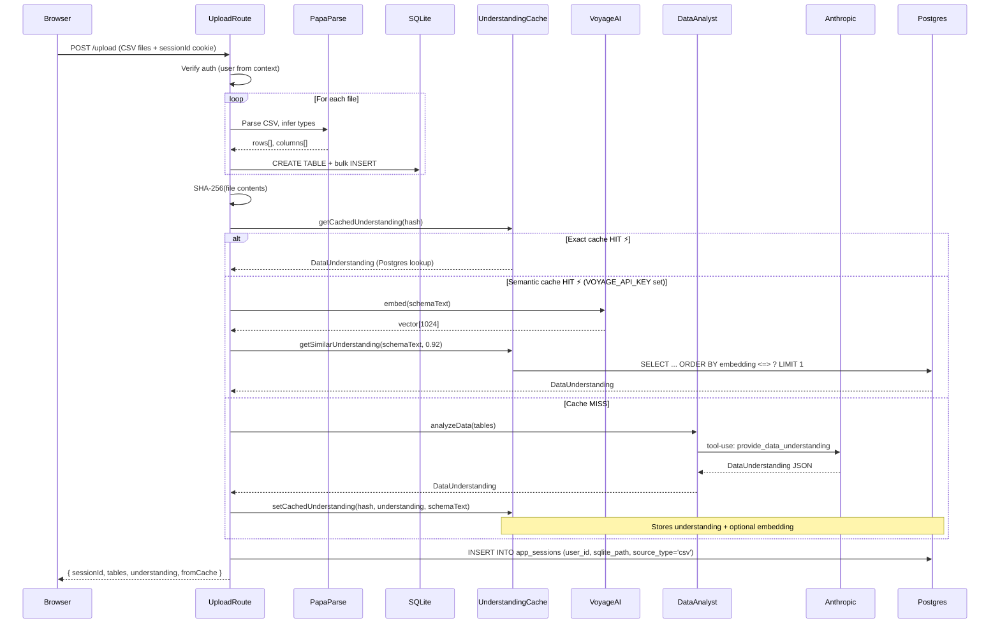

### Understanding Cache (two-layer)

```
Layer 1 — Exact:  SHA-256(content₁ | content₂ | …) → Postgres row lookup (O(1))
Layer 2 — Semantic (optional): embed(schemaText) → cosine similarity in pgvector
                                threshold: 1 - distance >= 0.92
```

Cache entries are stored in `understanding_embeddings` in Postgres. No separate SQLite cache file.

---

## 4. Live Database Connector Flow

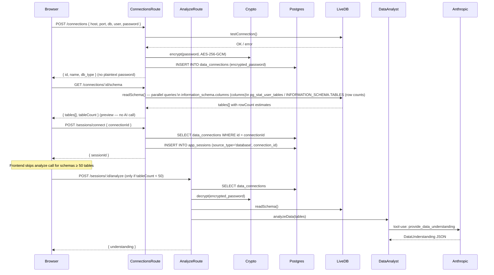

---

## 5. Query & Streaming Agent Flow

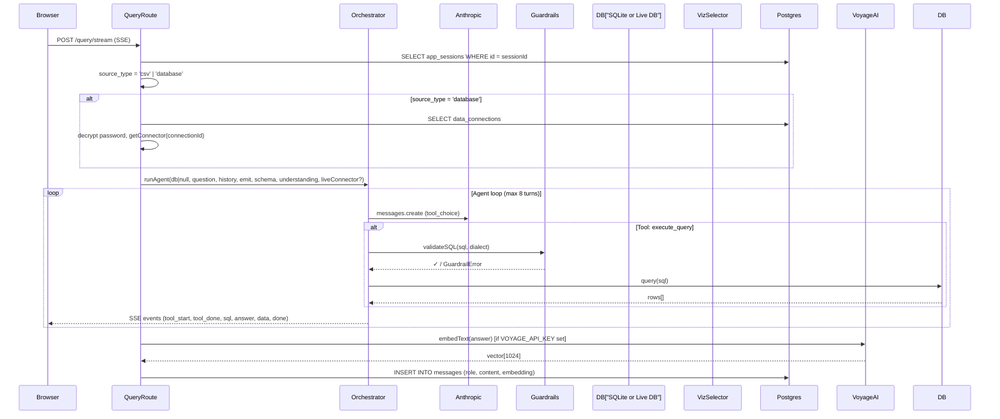

---

## 6. Semantic Session Search

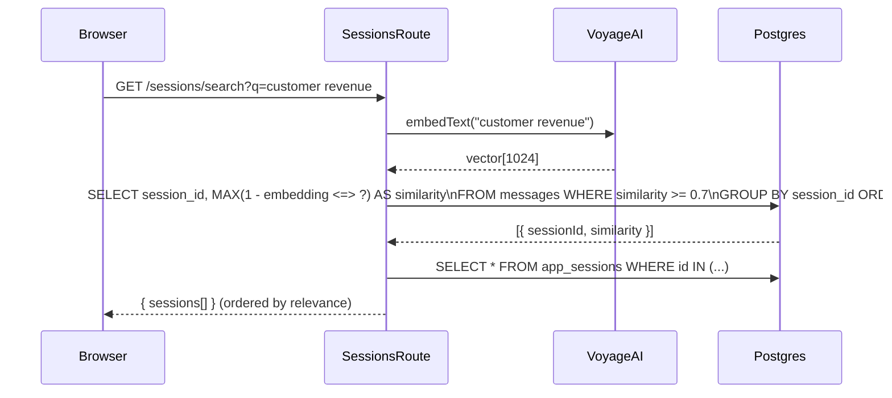

---

## 7. Agent Tool-Use Loop (Detail)

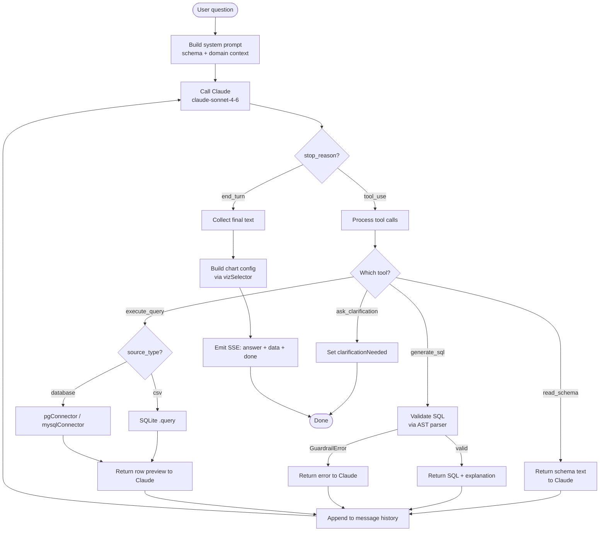

---

## 8. SQL Guardrails

Every SQL string passes through a two-layer check before touching any database. The dialect is passed in (`SQLite | PostgresQL | MySQL`) so `node-sql-parser` applies the correct rules.

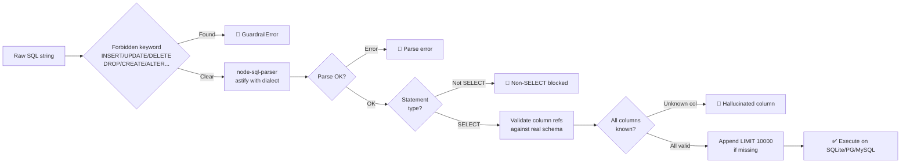

---

## 9. Visualization Selection

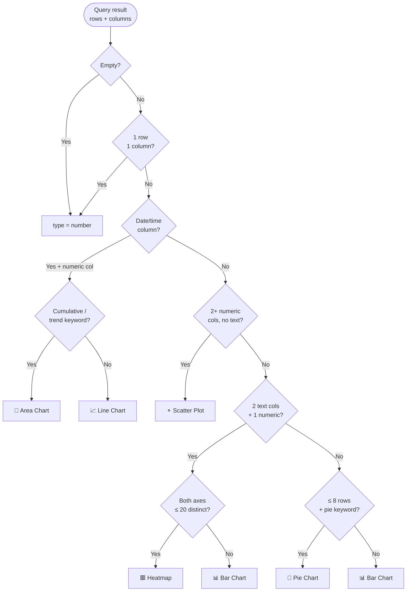

The `shouldShowChart` guard suppresses charts for scalar results and single-row results — the value renders inline in the text answer instead.

---

## 10. Storage Model

```
PostgreSQL (port 5433) — metadata only
├── user / session / account / verification   ← Better Auth managed
├── app_sessions                              ← One row per upload or DB connect
├── messages                                  ← Full conversation history + embeddings
├── data_connections                          ← External DB credentials (encrypted)
└── understanding_embeddings                  ← Schema understanding + pgvector index

sessions/ (disk) — actual data
├── <uuid-1>.db       ← SQLite for CSV session 1
│     ├── orders      ← User data table
│     ├── products    ← User data table
│     └── _session_meta  ← { understanding_hash }
└── <uuid-2>.db       ← SQLite for CSV session 2
    (live-DB sessions have no .db file — query goes directly to external DB)
```

- CSV sessions: SQLite file on disk, path stored in `app_sessions.sqlite_path`
- Live-DB sessions: `source_type = 'database'`, `connection_id` → credentials in `data_connections`
- Understanding cache moved from SQLite file to `understanding_embeddings` table in Postgres
- Message embeddings stored in `messages.embedding vector(1024)` — populated on insert when `VOYAGE_API_KEY` is set

---

## 11. Frontend State Machine

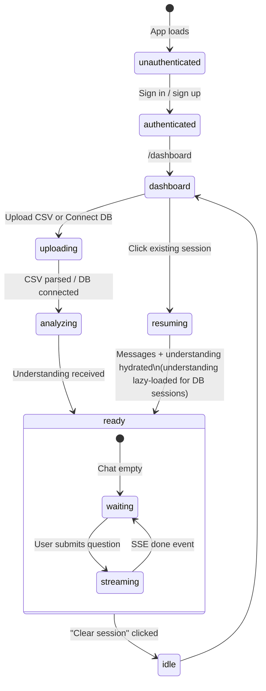

### Layout states

| State | Layout |
|---|---|
| `unauthenticated` | Sign-in / sign-up page |
| `dashboard` | Sessions list with search bar |
| `uploading` / `analyzing` | Full-screen landing — no panels |
| `ready` (< 50 tables) | Three-panel layout: insights+schema sidebar · chat · suggestions |
| `ready` (≥ 50 tables) | Two-panel layout: schema-only sidebar · chat (suggestions panel hidden) |

### Understanding rehydration on resume

When a session is resumed from the dashboard (`GET /sessions/:id`):

- **All sessions**: The backend reads `app_sessions.understanding` (JSONB) directly from Postgres. No SQLite hash lookup required. Understanding survives server restarts.
- **DB sessions** (or any session where `understanding` is null and `tableCount < 50`): The frontend fires `POST /sessions/:id/analyze` in the background after the chat UI is already visible. Insights populate once the call returns without blocking navigation.
- **Large DB sessions (≥ 50 tables)**: No `analyzeSession` call is made. The Insights tab and the "Ideas to Explore" right panel are hidden. The left sidebar shows Schema only.

---

## 12. SSE Event Schema

The `/query/stream` endpoint emits these events in order:

| Event type | When | Payload |
|---|---|---|
| `tool_start` | Before each tool runs | `{ tool, description }` |
| `tool_done` | After each tool completes | `{ tool, summary, error? }` |
| `sql` | After execute_query | `{ sql }` |
| `answer` | Final text ready | `{ text }` |
| `data` | Query data + chart ready | `{ data[], chart }` |
| `error` | Unhandled exception | `{ message }` |
| `done` | Stream complete | `{}` |

The frontend reads these via `fetch()` + `ReadableStream` (not `EventSource`, which only supports GET).

---

## 13. Credential Security

External DB passwords are never stored in plaintext.

```
Encryption: AES-256-GCM
Key source:  CREDENTIAL_ENCRYPTION_KEY env var (64-char hex = 32 bytes)
Format:      iv:tag:ciphertext  (all hex-encoded, stored as TEXT in data_connections)
Decryption:  only on the server, at query time, never sent to client
```

---


---

## 14. Multi-Turn Chart Refinement

After a chart is rendered, users can change how the data is visualised without re-running the query.

### Two mechanisms

**A. Type Switcher (UI)**
Pill buttons (`bar | line | area | pie | scatter | heatmap`) appear below every chart. Clicking one sets `activeChartType` on the message in local React state. `ChartRenderer` receives `overrideType` and re-renders instantly — zero network calls.

**B. Natural Language (client-side)**
`detectChartRefinement()` in `Chat.tsx` runs before the message is sent to the server. If the message matches both a refinement phrase and a chart type keyword, a new assistant message is created locally with the same `data` and `chart` config but the new `type`. The server is never called.

```
Refinement phrases: "make it", "change to", "show as", "switch to", "use a", "instead", "convert to", "display as"
Chart types:        pie | bar | line | area | scatter | heatmap
```

If the message contains a refinement intent but also other analytical content, it falls through to the normal server round-trip.

### Multi-View Panels

Each chart message can have up to N additional pinned views of the same data in different chart types, managed via `extraChartTypes: ChartType[]` in message state.

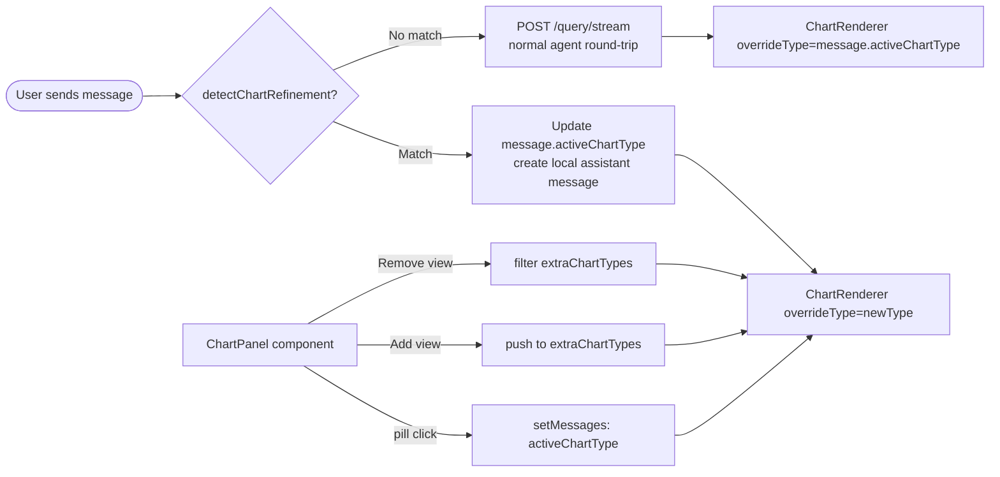

### `overrideType` key resolution

`ChartRenderer` receives the original `ChartConfig` (which has specific `xKey`, `yKey`, `labelKey`, `valueKey` for the original chart type) plus `overrideType`. When the override type needs different keys (e.g., pie needs `labelKey`/`valueKey` but the original was a bar with `xKey`/`yKey`), the component falls back to reading `Object.keys(data[0])`:

```
resolvedXKey    = xKey    ?? keys[0]
resolvedYKey    = yKey    ?? keys[1] ?? keys[0]
resolvedLabelKey = labelKey ?? resolvedXKey
resolvedValueKey = valueKey ?? resolvedYKey
```

This means any chart type can render any query result without needing to re-run the query or re-invoke vizSelector.

---

## 15. Export (PNG & CSV)

Both exports are pure client-side — no server involvement.

### PNG export

`html2canvas` captures the chart wrapper `<div ref={chartRef}>` at 2× device pixel ratio with a white background, producing a full-fidelity PNG of the rendered chart (including axis labels, legend, title).

```
ChartPanel.handleExportPNG()
  → import("html2canvas")   (dynamic import — not in initial bundle)
  → html2canvas(chartRef.current, { scale: 2, backgroundColor: "#fff" })
  → canvas.toDataURL("image/png")
  → <a download="<chart-title>.png"> .click()
```

The PNG button shows a loading state (`…`) while rendering. The export captures whatever chart type is currently active (including override types).

### CSV export

`exportToCSV()` converts `data: Record<string, unknown>[]` to an RFC-4180 CSV string entirely in memory, then creates a `Blob` download.

```
exportToCSV(data, "<chart-title>.csv")
  → headers = Object.keys(data[0])
  → rows: each value stringified, quoted if it contains , " or \n
  → Blob("text/csv;charset=utf-8")
  → <a download> .click()
```

The exported file always contains the raw query result — it is unaffected by the active chart type.

---

## 16. Large Schema Handling

### 16.1 Row count estimates (connectors)

`readSchema()` in both connectors runs **two queries in parallel** — one for column metadata, one for row count estimates. Neither query scans data rows.

| DB | Row count source | Notes |
|---|---|---|
| PostgreSQL | `pg_stat_user_tables.n_live_tup` | Autovacuum estimate; fast, O(1) per table |
| MySQL | `information_schema.TABLES.TABLE_ROWS` | Engine estimate; fast, O(1) per table |

Row counts are returned as part of `SchemaTable.rowCount` and propagated to the frontend, schema index scoring, and the `dataAnalyst` clustering sort.

### 16.2 UI gating by table count

The frontend derives `isLargeSchema = tables.length >= 50` (constant `LARGE_SCHEMA_THRESHOLD`).

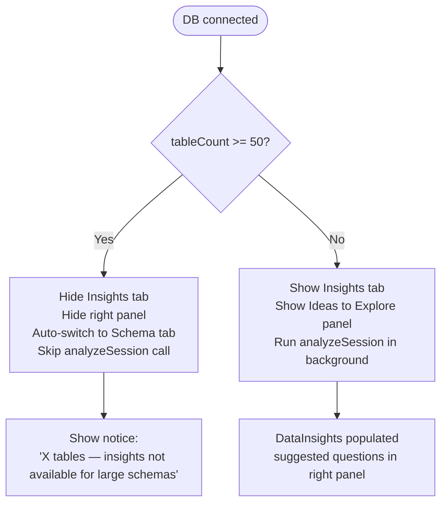

No tokens are spent on a large schema until the user asks their first question.

### 16.3 Contextual schema injection at query time

When `tables.length > MAX_SCHEMA_TABLES_PER_QUERY` (default 20), the orchestrator switches from full-schema injection to contextual injection:

```
1. Build keyword inverted index from all table/column names (camelCase + snake_case tokenised)
2. Score tables against the current query + last 3 turns
3. Inject full schema for top-20 scored tables
4. Prepend compact one-liner index of all table names
5. Expose lookup_schema tool for on-demand table expansion
```

The `lookup_schema` handler adds the requested table's columns to `allowedCols` so SQL guardrails don't block the subsequent query. Each `lookup_schema` call costs one agentic turn (hence the 8-turn cap).

### 16.4 Two-pass clustered insights (30–49 tables)

When `analyzeSession` is called for a schema with 30–49 tables, `dataAnalyst.ts` runs a two-pass analysis:

```
Pass 1 — cheap clustering (table names + row counts only)
Pass 2 — deep-dive per cluster, in parallel (full schema + 3 sample rows, top 3 tables by column count)
Synthesis — merge cluster DataUnderstandings into one
```

Single-pass analysis is used for ≤ 30 tables. Insights are skipped entirely for ≥ 50 tables.


---

## 17. Vector Database Usage (pgvector)

Clairvoyance uses PostgreSQL + pgvector for three distinct embedding workloads. All vectors are 1024-dimensional, produced by **Voyage AI `voyage-3-lite`**.

### 17.1 Tables

| Table | Purpose | Index |
|---|---|---|
| `messages.embedding` | Semantic session search — finds sessions where the user asked similar questions | ivfflat cosine (pre-existing) |
| `understanding_embeddings.embedding` | Understanding cache deduplication — avoids re-running AI analysis on similar schemas | ivfflat cosine (pre-existing) |
| `table_embeddings.embedding` | Per-table schema embeddings — enables semantic table selection for large schemas | ivfflat cosine (lists=100) |
| `app_sessions.understanding` | AI-generated domain understanding stored as JSONB — survives server restarts | — (no index needed) |

### 17.2 Per-Table Schema Embeddings

**When are they created?**
- After a CSV is uploaded (`POST /upload`) — non-blocking, fire-and-forget
- After an AI analysis runs (`POST /sessions/:id/analyze`) — non-blocking

**Schema text format** (what gets embedded per table):
```
"tableName: col1 (TYPE), col2 (TYPE), ... | N rows"
```

**How they're used (orchestrator.ts):**
```
tables.length > MAX_SCHEMA_TABLES_PER_QUERY (default 20)?
  YES → semantic: searchTablesByEmbedding(sessionId, queryContext, 20)
        fallback: searchSchema(schemaIndex, queryContext, 20)  [keyword]
  NO  → inject all tables
```

`queryContext` = current question + last 3 turns joined. This means the vector search uses full conversational context, not just the current question.

**Module:** `backend/src/db/tableEmbeddings.ts`
- `upsertTableEmbeddings(sessionId, tables)` — calls `embedBatch` (single Voyage round-trip for all tables)
- `searchTablesByEmbedding(sessionId, queryText, limit, allTables)` — cosine search, maps results back to `TableSchema[]`

### 17.3 Message Embeddings

Both the **user question** and **assistant answer** are now embedded per query turn using a single `embedBatch([question, answer])` call — one Voyage round-trip per chat message.

Previously only assistant messages were embedded. User messages are now embedded too, doubling the signal available for `GET /sessions/search`.

### 17.4 Understanding Persistence

`app_sessions.understanding` (JSONB) is written at:
1. CSV upload (if analysis ran)
2. `POST /sessions/:id/analyze`

`GET /sessions/:id` reads it directly — no more SQLite hash lookup. This fixes the bug where AI context was silently lost after a server restart.

**Module:** `backend/src/db/understandingCache.ts`
- `persistSessionUnderstanding(sessionId, understanding)` — writes to `app_sessions.understanding`
- `getSessionUnderstanding(sessionId)` — reads from `app_sessions.understanding` (was broken before; previously always returned `null`)

### 17.5 Graceful degradation

Every vector operation is wrapped in try/catch and is non-fatal. If `VOYAGE_API_KEY` is not set:
- Table selection falls back to keyword (`searchSchema`)
- Message embeddings are skipped (stored as `null`)
- Session search returns empty results with `"Semantic search not configured"` error field
- Understanding embeddings are stored without embedding vectors

---

## 18. Date Formatting

All date values rendered in the UI — chart axis labels, tooltips, table cells — go through a shared utility to ensure consistent, human-readable output.

**File:** `frontend/app/lib/formatDate.ts`

### Format styles

| Style | Example | Use case |
|---|---|---|
| `"full"` | Mar 15, 2024 | Table cells, default |
| `"short"` | Mar 15 | Chart axis labels |
| `"month"` | Mar 2024 | Year-month columns |
| `"time"` | Mar 15, 2024, 02:30 PM | Timestamp columns |

### Supported inputs
ISO datetime strings, ISO date strings, `YYYY-MM` year-month strings, Unix timestamps (ms and s), and `Date` objects. Non-date values are returned as-is — safe to call on any value.

### Key exports

```ts
formatDate(value, style?)          // General-purpose formatter
formatAxisLabel(value, columnName?) // Smart: formats dates, truncates long strings
formatTooltipValue(value, columnName?) // Full-date for tooltips
isDateLike(value)                  // Guard check
isDateColumn(columnName)           // Detects date columns by name heuristic
```

### Where it's wired
`ChartRenderer.tsx` applies `formatAxisLabel` to all X-axis ticks and `formatTooltipValue` to all tooltip labels across bar, line, area, pie, scatter, and heatmap chart types.

A Copilot skill file is saved at:
`~/Library/Application Support/Code - Insiders/User/prompts/clairvoyance-date-formatting.prompt.md`
