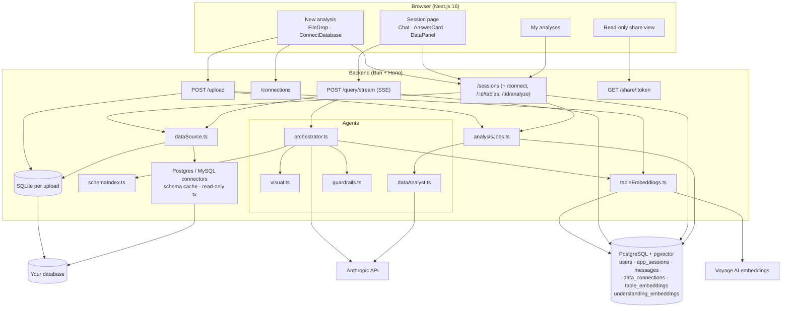
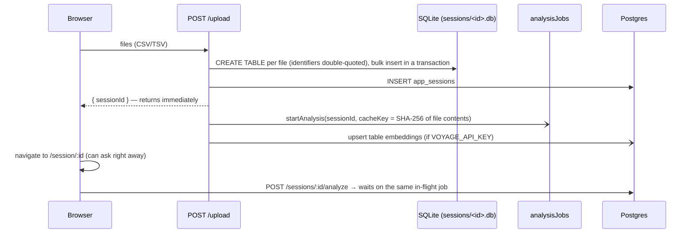
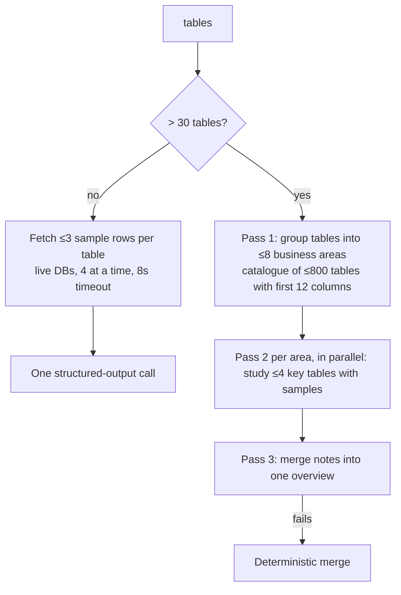
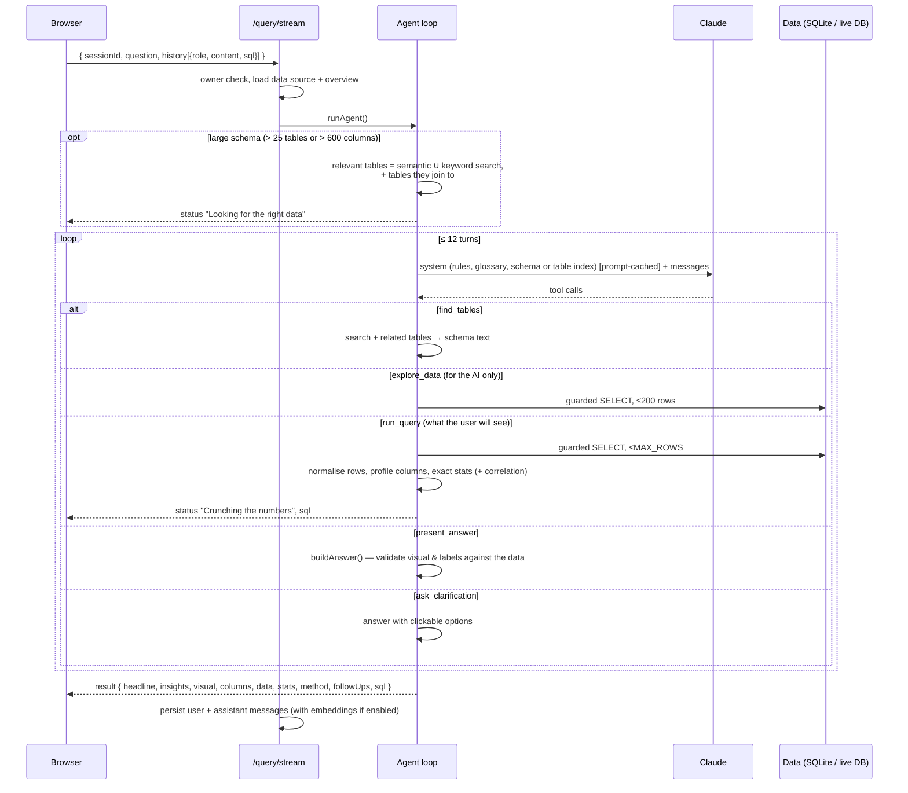
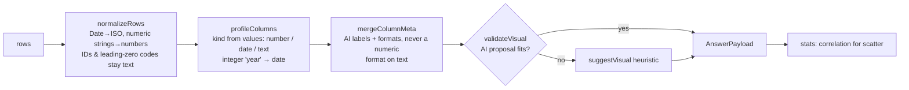
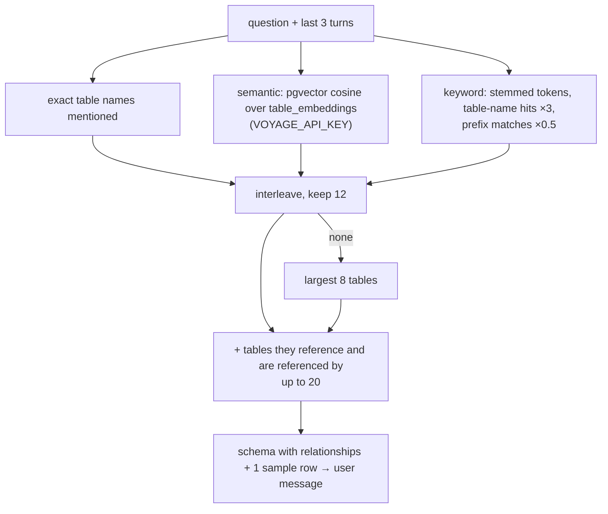

# Clairvoyance — Architecture

How the pieces fit together, from upload to the answer card.

---

## 1. System overview



---

## 2. Getting data in

### CSV upload (`routes/upload.ts`)



### Live database (`routes/connections.ts`, `routes/sessions.ts`)

1. `POST /connections` tests the credentials with a throwaway connector (closed afterwards), encrypts the password (AES-256-GCM, `CREDENTIAL_ENCRYPTION_KEY`) and saves — re-using the existing row if the same host/db/user was saved before. Driver errors are translated ("The username or password was rejected").
2. `POST /sessions/connect` creates the session and, in the background, loads the schema, embeds tables and starts the overview analysis.
3. The frontend accepts a pasted connection string (`postgres://…`, `mysql://…`, `?sslmode=require`) and parses it client-side (`parseConnectionString` in `lib/api.ts`), or a short manual form.

### Connectors (`db/connectors/`)

| | PostgreSQL | MySQL |
|---|---|---|
| Columns | `information_schema.columns` | `INFORMATION_SCHEMA.COLUMNS` |
| Row estimates | `pg_class.reltuples` (falls back to `n_live_tup`) | `TABLES.TABLE_ROWS` |
| Foreign keys | `pg_constraint` (multi-column aware) | `KEY_COLUMN_USAGE` |
| Numbers | BIGINT / NUMERIC parsed to JS numbers | `decimalNumbers`, `supportBigNumbers` |
| Safety | `BEGIN READ ONLY` + `statement_timeout` | `START TRANSACTION READ ONLY` + query timeout |

Table names are emitted ready to paste into SQL: `orders`, `"AdCampaigns"`, `analytics.daily_visits`. `CachedConnector` caches `readSchema()` per connection for `SCHEMA_CACHE_TTL_MS` and de-duplicates concurrent reads. Pools: 5 connections, 60 s idle timeout.

`db/dataSource.ts` is the single place that turns a session row into `{ kind: "csv", db } | { kind: "database", connector }` plus its tables, after verifying the session belongs to the requesting user.

---

## 3. Getting to know the data (`agents/dataAnalyst.ts`)

Produces a `DataUnderstanding`:

```ts
{ domain, summary, keyFeatures: [{ column, label, description, importance }],
  suggestedQuestions, primaryMetrics, areas: [{ name, description }] }
```

All user-facing text is written for business readers (no table/column names). `column` keeps the exact reference so the query agent can map "Order value" → `orders.total_amount` (it's injected into the agent prompt as a glossary).



Calls use **structured outputs** (`output_config.format` with a JSON schema) through `lib/llm.ts`. Results are cached exactly (content hash for CSV, schema fingerprint for databases) in `understanding_embeddings`, and stored on `app_sessions.understanding`. `analysisJobs.ts` ensures one analysis per session at a time.

---

## 4. Answering a question (`agents/orchestrator.ts`)



Details:

- **Tools**: `find_tables` (large schemas only), `explore_data`, `run_query`, `present_answer`, `ask_clarification`. Tool choice is `auto`; the prompt asks for exactly one `present_answer`. If the model ends with plain text instead, that text becomes the headline and the visual is chosen heuristically.
- **What the model sees from `run_query`**: row count, column kinds, a summary over *all* rows (min/max/sum/average per measure, distinct counts, correlation of the first two measures) and a 40-row preview — so quoted totals are exact even for large results.
- **Follow-ups**: earlier answers are sent back with the SQL that produced them (`[Data used for that answer: …]`), so "now split it by region" builds on the previous query.
- **Prompt caching**: tools + system prompt (rules, glossary, schema or table index) are a stable prefix with `cache_control`; the per-question relevant-table schema goes in the user message.
- **Status events** use plain language; SQL errors are fed back to the model (`is_error`) and shown to the user only as "Adjusting the approach".
- **Errors** reach the user as actionable sentences (bad API key, rate limit, database unreachable).

### SSE events

| Event | Payload |
|---|---|
| `status` | `{ id, label, detail?, state: "active" \| "done" \| "error" }` |
| `sql` | `{ sql }` |
| `result` | `{ answer: AnswerPayload }` |
| `error` | `{ message }` |
| `done` | `{}` |

The browser reads them with `fetch` + `ReadableStream` and can abort (Stop button); the server stops the agent when the client disconnects.

---

## 5. From rows to a visual (`agents/visual.ts`)



Validation rules include: referenced columns must exist; plotted measures must be numeric; KPI only for ≤ 3 rows; pie only for ≤ 8 non-negative parts; scatter needs a numeric x. `MAX_CLIENT_ROWS` (1,000) rows are sent/stored; `totalRows` and `truncated` tell the UI when there were more.

### Rendering (`frontend/app/components/Answer/Visual.tsx`)

- **Formatting** (`lib/format.ts`): currency/percent/ratio/number with compact axis ticks (`$1.2M`); dates parsed without timezone shift and labelled by detected grain (year, quarter, month, day) — `Feb` within one year, `Feb ’24` across years.
- **Bars**: top 15 categories (the table has all), horizontal when labels are long or there are > 8; grouped when there's a series column.
- **Series**: long data is pivoted to one line/bar group per category, top 7 by total + "Other".
- **Different units** (e.g. revenue and order count) render as small multiples — never two y-axes.
- **Pie**: donut, ≤ 6 slices + "Other", with a value/percent legend.
- **Scatter**: trend line (least squares), integer-aware axes, label column in the tooltip; the card shows the correlation in words.
- **KPI**: up to 4 tiles, compact value with the exact value beneath.
- Every visual has a Table view; CSV export uses the friendly column labels; PNG export via `html2canvas`.
- Categorical colours follow a fixed order validated for colour-vision deficiency (`SERIES_COLORS`, mirrored as `--color-series-*`).

Older stored messages (free-form markdown + `chart` config) are converted by `toAnswer()` and still render.

---

## 6. Finding tables in big databases



- `inferForeignKeys()` adds `customer_id → customers.id`-style links (marked `?` in the prompt) where no constraint exists.
- Embeddings are created at upload/connect and lazily on the first question (`ensureTableEmbeddings`), 128 tables per Voyage request, bulk-upserted.
- Search is exact (no ivfflat): it's always filtered to one session's few-to-few-thousand rows, where an approximate index applied before the filter could silently miss tables (migration `0002_exact_table_search.sql`).
- The system prompt also carries a compact index of up to 1,500 table names with row counts, so the model knows what exists and can call `find_tables`.

---

## 7. Storage

```
PostgreSQL (metadata)
├── user / session / account / verification   Better Auth
├── app_sessions          one per analysis; understanding (jsonb), share_token
├── messages              question + answer payload (jsonb) + embedding vector(1024)
├── data_connections      saved databases, encrypted password
├── table_embeddings      per-session per-table vector(1024)
└── understanding_embeddings  exact-match overview cache

backend/sessions/<uuid>.db   uploaded files as SQLite tables (live-DB sessions have none)
```

Migrations live in `backend/drizzle/` and are listed in `meta/_journal.json` (`0000` enables `vector`, `0001` adds embeddings + understanding, `0002` drops the approximate index).

---

## 8. Security

- Auth middleware on everything except `/health`, `/api/auth/*`, `/share/:token`.
- Every session/connection route checks ownership (`getOwnedSession`, `ownedConnection`).
- SQL: forbidden-keyword check (ignoring string literals) → AST parse → single SELECT only → column names checked against the schema → row cap. Live databases additionally run each statement in a read-only transaction with a timeout.
- Passwords: AES-256-GCM, `iv:tag:ciphertext`, decrypted only server-side when a connector is built.
- Share links expose questions and answers (including result rows) but never connection details.

---

## 9. Claude usage (`lib/llm.ts`)

- One client, model from `CLAIRVOYANCE_MODEL` (default `claude-opus-5-5`).
- Agent turns: `effort: "medium"`, `max_tokens: 16000`, cached system prompt, abortable.
- Overviews: structured outputs with JSON schemas, `effort: "low"`.
- Server-side refusal fallbacks (`fallbacks: "default"`) are enabled on models that support them; `ANTHROPIC_REFUSAL_FALLBACK=off` disables this for gateways that reject the parameter.
- Assistant turns (including thinking blocks) are appended unchanged during the tool loop.
