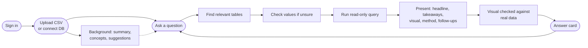

# Clairvoyance

**Ask your data anything — in plain English.**

Upload a spreadsheet or connect a database, then ask questions the way you'd ask an analyst: *"How did revenue trend this year?"*, *"Is discount size related to order value?"*, *"Which regions are slipping?"*. You get a one-sentence answer, a few useful takeaways, and the right chart (or no chart, when a number says it all). No SQL, and no need to know how the data is organised.

Built for product managers, business analysts and anyone else who has questions but not the database diagram.

---

## How it works

```
Sign in → Upload CSV or connect a database → Clairvoyance gets to know the data → Ask → Answer + chart
```

1. **Bring data.** Drop one or more CSV files, or connect PostgreSQL / MySQL by pasting a connection string (or filling in a short form). Saved databases are one click next time.
2. **Clairvoyance gets to know it** — in the background, so you can start asking immediately. It writes a plain-language summary, lists the business concepts it found ("Order value", "Signup date"), and suggests questions. Big databases (hundreds of tables) are grouped into topic areas first.
3. **Ask.** Type a question or click a suggestion. While it works you see plain progress ("Looking for the right data", "Crunching the numbers") and can stop at any time.
4. **Get an answer you can use:**
   - a **headline** that answers the question with the key numbers formatted (`$1.2M`, `34%`)
   - up to three **takeaways** that add something the headline doesn't
   - a **visual chosen for the question** — trend line, ranked bars, share donut, scatter with relationship strength, headline-number tiles, or a table — with friendly labels and a Chart/Table toggle
   - **"How I worked this out"** in one plain sentence (the SQL is one more click away for technical readers)
   - **follow-up questions** to keep exploring; follow-ups build on the previous answer
5. **Keep and share.** Every analysis is saved. Share a read-only link, download CSV (opens in Excel) or the chart as an image.



---

## Stack

| Layer | Technology |
|---|---|
| Frontend | Next.js 16, React 19, Tailwind CSS 4, Recharts 3 |
| Backend | Bun + Hono (TypeScript) |
| Auth | Better Auth (email/password + optional Google/GitHub OAuth) |
| AI | Anthropic Claude via `@anthropic-ai/sdk` — `claude-opus-5-5` by default (`CLAIRVOYANCE_MODEL`) |
| Embeddings | Voyage AI `voyage-3-lite` (1024-dim, optional) |
| Metadata DB | PostgreSQL 16 + **pgvector** + Drizzle ORM |
| Uploaded data | SQLite via `bun:sqlite` (one file per analysis) |
| DB connectors | `pg` (PostgreSQL), `mysql2` (MySQL) |
| SQL safety | `node-sql-parser` (SELECT-only, AST-validated) + read-only transactions |
| Streaming | Server-Sent Events (Hono `streamSSE`) |

---

## Getting started

### Prerequisites
- [Bun](https://bun.sh) ≥ 1.0
- [Docker](https://www.docker.com) (for the Postgres metadata database) — or any Postgres 16 with the `vector` extension available
- An [Anthropic API key](https://console.anthropic.com)

### 1. Start PostgreSQL

```bash
docker compose up -d
```

Starts PostgreSQL 16 with pgvector on **port 5433**.

### 2. Backend

```bash
cd backend
cp .env.example .env
# Edit .env — required: ANTHROPIC_API_KEY, BETTER_AUTH_SECRET, CREDENTIAL_ENCRYPTION_KEY
bun install
bunx drizzle-kit migrate   # creates all tables (and enables the vector extension)
bun run dev                # → http://localhost:3001
```

### 3. Frontend

```bash
cd frontend
bun install
bun run dev                # → http://localhost:3000
```

Set `NEXT_PUBLIC_API_URL` in `frontend/.env.local` if the backend isn't on `http://localhost:3001`.

### Both at once (from the project root)

```bash
bun run dev
```

### Checks

```bash
cd backend && bun test && bun run typecheck
cd frontend && bun run lint && bun run build
```

### Environment variables

**Required** (`backend/.env`)

| Variable | Description |
|---|---|
| `ANTHROPIC_API_KEY` | Anthropic API key |
| `DATABASE_URL` | Postgres connection string for Clairvoyance's own metadata |
| `BETTER_AUTH_SECRET` | Random secret for session signing (≥ 32 chars) |
| `CREDENTIAL_ENCRYPTION_KEY` | 64-char hex key used to encrypt saved database passwords (`openssl rand -hex 32`) |

**Optional**

| Variable | Default | Description |
|---|---|---|
| `VOYAGE_API_KEY` | — | Semantic (pgvector) table search for large databases, and search over past questions on the dashboard |
| `CLAIRVOYANCE_MODEL` | `claude-opus-5-5` | Claude model used for analysis and answers |
| `ANTHROPIC_REFUSAL_FALLBACK` | on | Server-side refusal fallback on supported models; set `off` if your API gateway rejects it |
| `PORT` | `3001` | Backend port |
| `BETTER_AUTH_URL` / `BETTER_AUTH_TRUSTED_ORIGIN` / `FRONTEND_ORIGIN` | localhost | URLs for auth callbacks, share links and CORS |
| `GOOGLE_CLIENT_ID` / `GOOGLE_CLIENT_SECRET` | — | Google sign-in |
| `GITHUB_CLIENT_ID` / `GITHUB_CLIENT_SECRET` | — | GitHub sign-in |
| `MAX_ROWS` | `10000` | Max rows any query may return |
| `MAX_CLIENT_ROWS` | `1000` | Rows sent to the browser and stored with each answer |
| `DATA_ROWS_TO_MODEL` | `40` | Preview rows the AI sees (it also gets exact statistics over all rows) |
| `QUERY_TIMEOUT_MS` | `30000` | Per-statement timeout on live databases |
| `SCHEMA_CACHE_TTL_MS` | `600000` | How long a live database's table list is cached |
| `FULL_SCHEMA_TABLE_LIMIT` | `25` | Above this many tables (or 600 columns) only the relevant tables go into each prompt |

---

## Key features

### Answers written for business readers
The agent finishes every question with a structured `present_answer` call: headline, takeaways, method, follow-ups, a suggested visual and a friendly label + format (currency, percent, date…) for every column. The prompt forbids database jargon in anything the reader sees. Relationship questions get a plain-language strength statement ("a strong positive relationship, correlation 0.78") computed from the data — not guessed — plus a reminder that correlation isn't causation.

### Charts that fit the question (or no chart)
The AI proposes a visual; `backend/src/agents/visual.ts` checks it against the actual result (columns exist, measures are numeric, a pie has ≤ 8 non-negative parts…) and falls back to a value-based heuristic if it doesn't fit. Column types come from the values, not the names, so `day_count` is a number and `2024-03` is a month.

| Result shape | Default visual |
|---|---|
| One row of numbers | Headline-number tiles (up to 4) |
| Time + measure(s) | Line (area for cumulative questions); measures with different units become stacked small charts, never a dual axis |
| Time + category + measure | One line per category (top 7 + "Other") |
| Category + measure | Bars — horizontal when labels are long or there are many; top 15 shown, all in the table |
| Two categories + measure | Grouped bars |
| A few parts of a whole ("share", "breakdown") | Donut with percentages (≤ 6 slices + "Other") |
| Two measures | Scatter with trend line and correlation |
| Lists of records / text only | Table |

Every visual has a Table view, CSV download and image export. The categorical palette is checked for colour-vision deficiency.

### Big databases
- **Schema cache** per connection (the old code re-read the whole catalogue on every question).
- **Relationships**: real foreign keys are read from Postgres/MySQL, and obvious ones (`customer_id` → `customers.id`) are inferred when a database has none — so the AI knows how to join.
- **Finding the right tables**: semantic search over per-table embeddings in **pgvector** (with `VOYAGE_API_KEY`) merged with keyword search (stemmed, prefix-aware), then expanded with the tables those join to. A `find_tables` tool lets the AI look further. A compact index of every table name stays in the (prompt-cached) system prompt.
- **Overview for any size**: databases with more than 30 tables are grouped into business areas, a few representative tables per area are studied (with sample rows), and the notes are merged into one summary.
- Tested against Postgres catalogues with schema-qualified and mixed-case (`"AdCampaigns"`) tables.

*Is a dedicated vector database needed?* No. The vector workload here is per-session table search and message search — thousands of vectors, not billions — which pgvector inside the existing Postgres handles with exact search in milliseconds, with no extra service to run.

### Safety
- Only single `SELECT` statements pass the AST guardrail; column names are checked against the real schema.
- Live-database queries run inside **read-only transactions** with a statement timeout, so even a guardrail miss can't write.
- Saved passwords are AES-256-GCM encrypted; sessions are only reachable by their owner.

### Sessions, sharing and search
- Every analysis is saved; the dashboard shows each one's topic, summary and question count.
- Share a read-only link (`/share/<token>`) and turn it off any time.
- Dashboard search filters by name/topic instantly and, with `VOYAGE_API_KEY`, also searches past questions semantically.

---

## Project structure

```
clairvoyance/
├── docker-compose.yml               Postgres 16 + pgvector (port 5433)
├── backend/
│   ├── drizzle/                     SQL migrations (+ meta/_journal.json)
│   └── src/
│       ├── index.ts                 Hono app — routers, CORS, auth, public share route
│       ├── routes/
│       │   ├── upload.ts            POST /upload — CSV → SQLite, background analysis
│       │   ├── query.ts             POST /query/stream — SSE answer stream, persists messages
│       │   ├── sessions.ts          /sessions CRUD, /connect, /:id/tables, /:id/analyze, share, search
│       │   └── connections.ts       /connections — test, save (encrypted), preview, delete
│       ├── agents/
│       │   ├── orchestrator.ts      Question-answering agent (find → explore → query → present)
│       │   ├── visual.ts            Result profiling, labels/formats, stats, visual validation
│       │   ├── dataAnalyst.ts       Plain-language overview (single pass or by business area)
│       │   └── guardrails.ts        SQL AST validation
│       ├── db/
│       │   ├── dataSource.ts        Session → SQLite or live connector + schema
│       │   ├── analysisJobs.ts      De-duplicated background analysis per session
│       │   ├── schemaIndex.ts       Keyword search, inferred relationships, related tables
│       │   ├── tableEmbeddings.ts   pgvector table embeddings (semantic table search)
│       │   ├── understandingCache.ts Exact-match cache of overviews
│       │   ├── schemaReader.ts      SQLite schema + prompt formatting
│       │   ├── manager.ts           Per-session SQLite files
│       │   ├── schema.ts / pgClient.ts  Drizzle tables + pool
│       │   └── connectors/          Postgres & MySQL (schema cache, FKs, read-only queries)
│       └── lib/                     llm.ts (Claude), embeddings.ts, crypto.ts, auth.ts
└── frontend/app/
    ├── page.tsx                     New analysis: upload or connect
    ├── dashboard/page.tsx           My analyses
    ├── session/[id]/page.tsx        Conversation with your data
    ├── share/[token]/page.tsx       Read-only shared view
    ├── (auth)/                      Sign in / sign up
    ├── lib/                         api.ts (types + SSE client), format.ts (numbers/dates), authClient.ts
    └── components/
        ├── Answer/                  AnswerCard + Visual (charts, KPI tiles, table)
        ├── Chat/                    Conversation, progress, composer
        ├── DataPanel/               "About this data" drawer
        ├── DataUpload/              File drop + database connect
        ├── Auth/, AppHeader.tsx, SessionGuard.tsx, ui.tsx
```

See [ARCHITECTURE.md](./ARCHITECTURE.md) for how each part works.

---

## Roadmap

- [ ] Excel (.xlsx) upload without exporting to CSV first
- [ ] Pin answers to a dashboard and refresh them
- [ ] BigQuery / Snowflake connectors
- [ ] Session expiry + storage cleanup job
